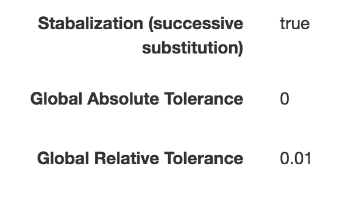
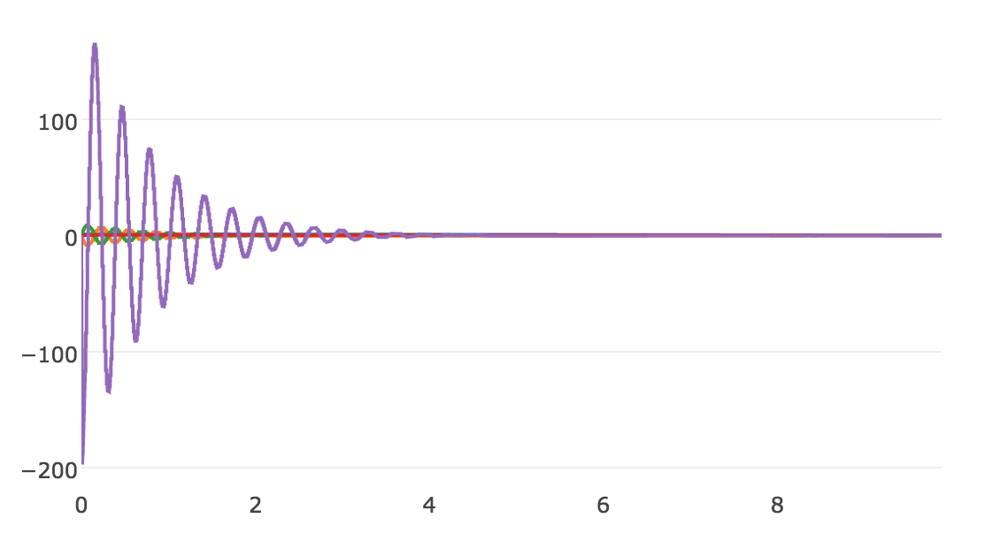
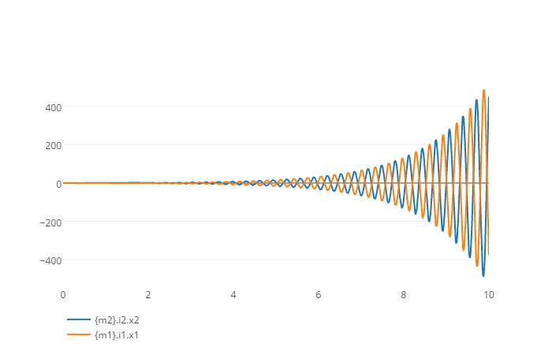

# Case Study Showcasing a Stabilization Technique

## Overview

## Running the Case Study

## Detailed Analysis

The option is enabled in the co-simulation config:

# With stabilization

# Without stabilization

