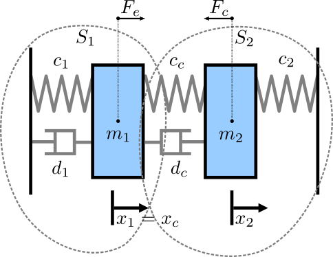

# Mass Spring Damper

## Overview
The mass spring damper study comprises two mass spring dampers and demonstrates how the sucessive substitution technique can be used to ensure that a co-simulation is stable. More information about successive substitution and other co-simulation stabilization techniques, please see [this paper](https://arxiv.org/pdf/1702.00686v1).

There are two simulators included in the study, each representing a mass spring damper system. The first simulator calculates the mass displacement and speed of *m1* for a given force *Fk* acting on mass *m1*. The second simulator calculates force *Fk* given a displacement and speed of mass *m1*. By coupling these simulators, the evolution of the position of the two masses is computed.

## Supported Features
This study supports the following INTO-CPS technologies:

* 20-Sim (for FMU)
* OpenModelica (for FMU)
* Co-simulation Engine (COE)

## Additional Information
For more information about this case study, contact the case study owner, [Casper Thule](mailto:casper.thule@eng.au.dk).
