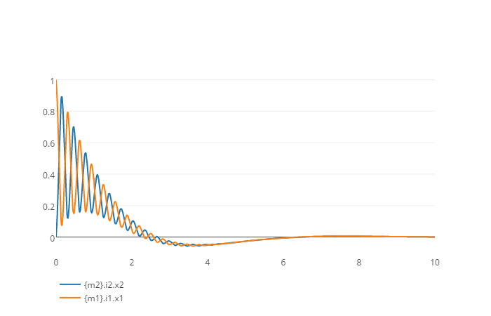

# Case Study Showcasing a Stabilization Technique

This case study shows how the sucessive substitution technique can be used to ensure that a co-simulation is stable.

To know more about co-simulation, successive substitution and other stabilization techniques, please have a look at [this](https://arxiv.org/pdf/1702.00686v1).

## Overview

The multi-model (a.k.a. co-simulation scenario) used in this case study consists of two simulators (simulator 1 and 2), each representing a mass spring damper system.
The original system is formed by the two mass-spring-dampers as shown next:

Simulator 1 expects an input that represents the force Fk acting on mass m1, and produces the mass displacement and speed of m1 as outputs.
Simulator 2 expects as input the displacement and speed of mass m1, and produces the force Fk.
Under this coupling, the following figure shows the evolution of the position of the two masses, computed not by co-simulation, but by a single numerical solver operating directly on the differential equations.

## Running the Case Study

### Unstable Co-simulation 

To compute the co-simulation of the above system in INTO-CPS, open the project in the root folder of this repository, expand the "Stability" multi-model, double click on "Unstable", make sure the Co-simulation Engine is online, and then click "Simulate".
The result should be the following:

Clearly this does not match the original system behavior: in the original system, but trajectories x1 and x2 tend to 0 over time, i.e., they are stable around the equilibrium point, which is 0.
Whereas the trajectories produced by the co-simulation seems to increase indefinitely.

To see why this behavior is not physically correct, note that the damping constants in the original system are positive constants, which means that there is friction whenever any of the two masses are moving.
If there is friction, there is loss of energy (e.g., in the form of heat).
Since there is no energy being added to the system, the total energy of the system (kinectic plus potential) should decrease over time.
Instead, the energy of the co-simulation seems to be increasing over time, i.e., the co-simulation is unstable, even when the original system is stable.
In the next section, we formally show why this is the case.

### Stable Co-simulation 

To get a stable co-simulation, repeat the steps described in the previous section, but instead of clicking in the "Unstable" configuration, click on the "Stable" one.
The result should be similar to the following.

The difference between the two configurations (Stable and Unstable) lies the application of the stabilization (successive substitution).
All the other system parameters are the same.
For a detailed explanation of this and other stabilization techniques, please refer to this [report](https://arxiv.org/pdf/1702.00686v1)

## Formal Analysis

A formal analysis of this case study is carried out [here](https://arxiv.org/pdf/1702.00686v1), section "Compositional Stability" (Page 33), and references thereof.
Here we just give the results.

To formally show that the co-simulation is stable, one can embed the co-simulation orchestration algorithm into the original system equations.
Since the original continuous system is a linear autonomous ODE, the resulting discrete time system is linear and autonomous as well.

A linear autonomous discrete time system is stable if and only if the spectral radius, that is, the largest real part of the eigen values of the system matrices, is smaller than 1.

Since the only difference between the stable and the unstable co-simulation is the use co-simulation algorithm (using the stabilization feature of not), the stabilization technique causes the system matrix to change in such a way that its spectral radius is smaller than one.

